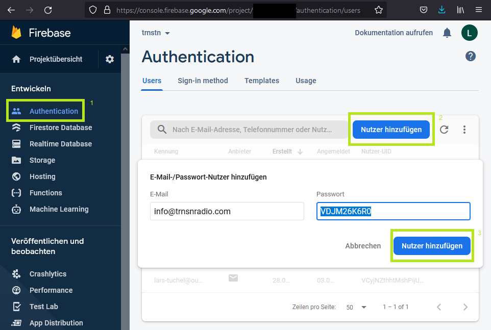
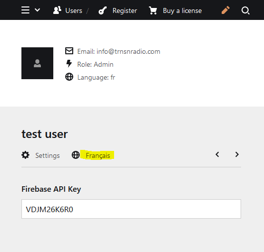

# Installation Guide

## 0. Install Plugin

Drop contents of zip into _site/plugins/trnstnform_. It should like this afterwards:

```
site/
\-- plugins/
    \-- trnstnform/
        |-- assets/
        |-- templates/
        |-- index.js
        \-- index.php
```

## 1. Add Firebase API Key Field

In _site/blueprints/users/admin.yml_ add a new field named `firebaseKey`

```yml
title: Admin
description: Full access


columns:
  - width: 1/2
    fields:
      firebaseKey:
        label: Firebase API Key
        type: text
```

## 2. Create Firebase User

In firebase create a new user with a random password (e.g. using this [random.org](https://www.random.org/strings/?num=1&len=10&digits=on&upperalpha=on&loweralpha=on&unique=on&format=html&rnd=new))



## 3. Add the key to the user settings

In kirby add the password from above in the Firebase API Key field:

**Make sure you select "Français" as the language first**


